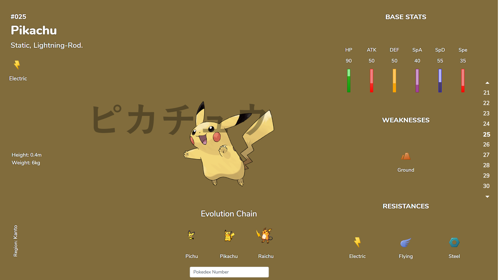
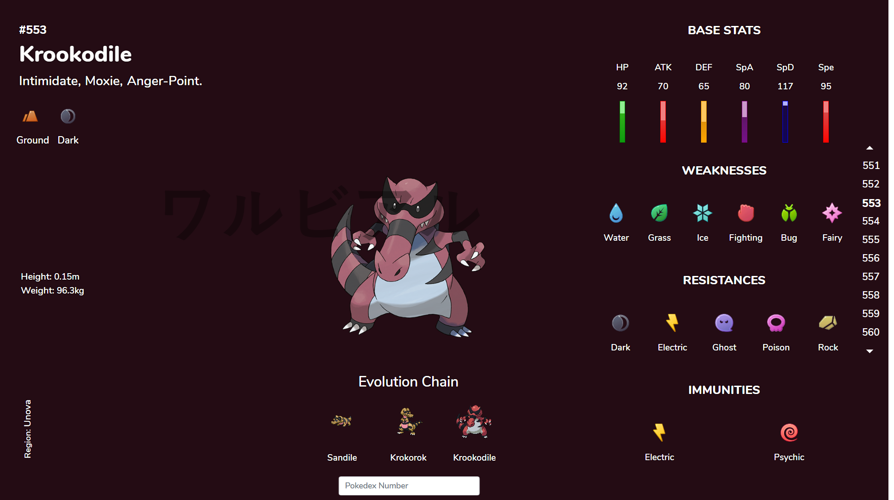
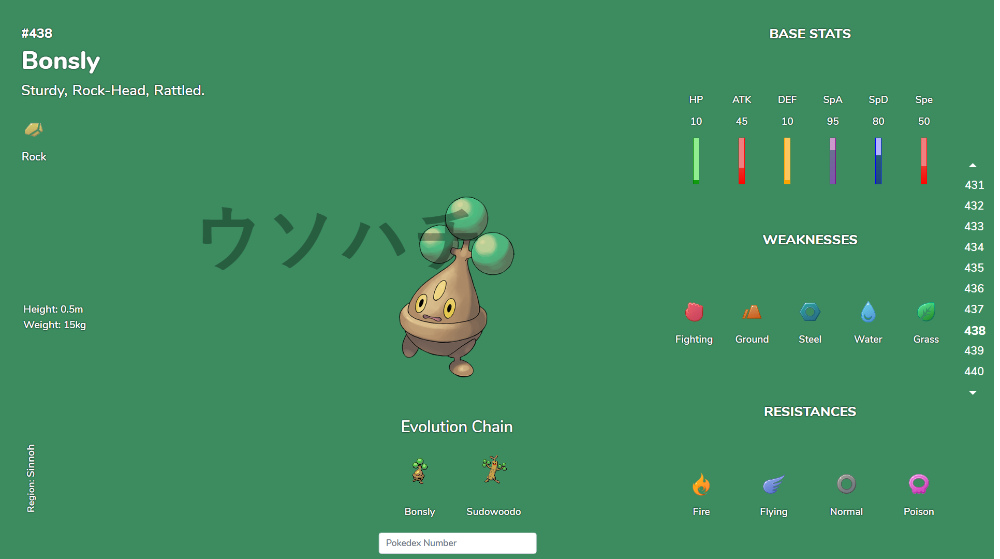
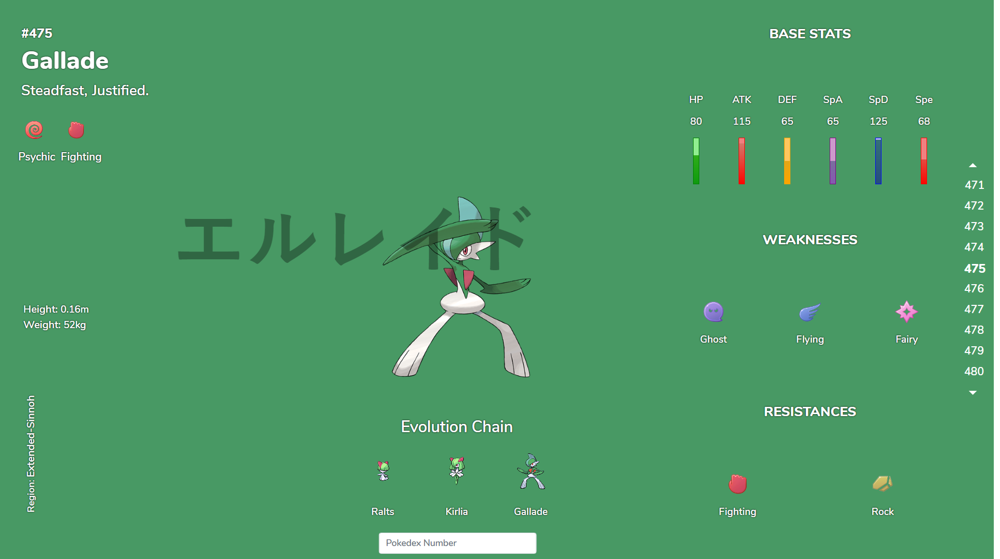
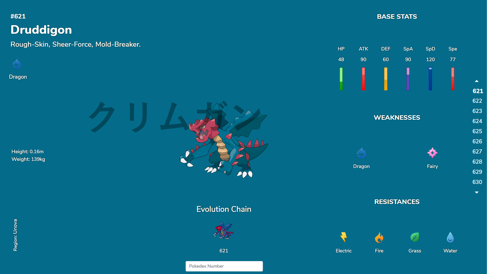

# Pokedex-API
Reinforcing API concepts and web development concepts + PokeAPI + Bootstrap + Responsive

# Live Now! Check It Out [Pokemon Pokedex (720 Pokemon)](http://abdikasa.github.io/Pokedex-API)

# Inspiration
I was only taught the basics of JavaScript during my second semester and fell in love. I like to make pretty websites but I need the design
created ahead of time. For this project, I explored more into JS, especially about APIs, promises, etc. Then I decided I've watched enough tutorials 
and wanted to create a simple project to show my knowledge. A simple pokedex, just painting data from the API essentially, nothing too crazy.

I got the design from Dean Harrison on his Behance Profile, here's the [link](https://www.behance.net/gallery/41007813/Pokedex-Entries-Redesigned)
Here's a few excerpts from his page and my attempt to reflect it loosely.

# 

